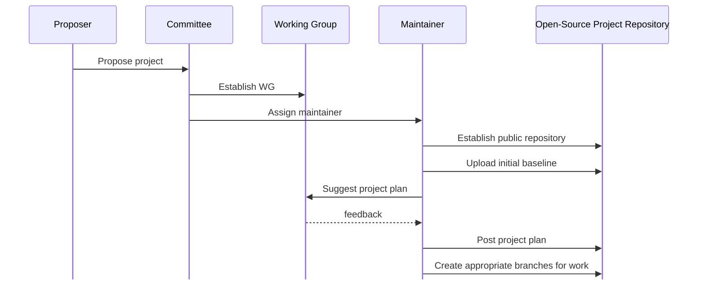
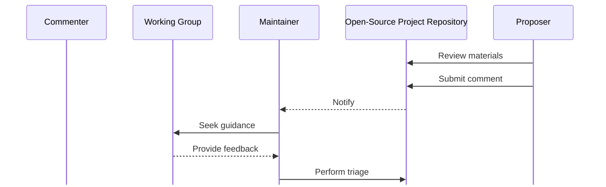
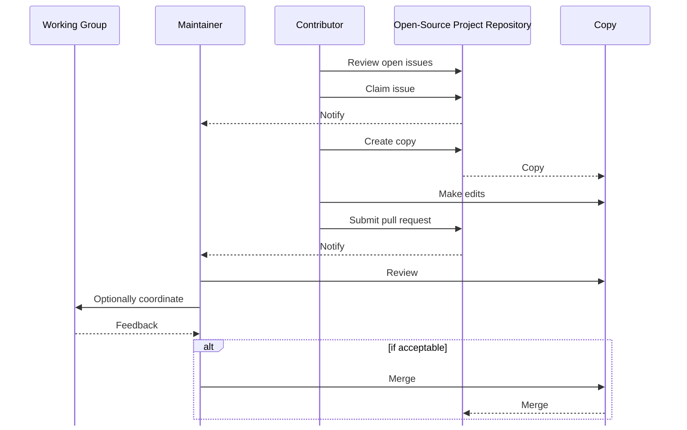
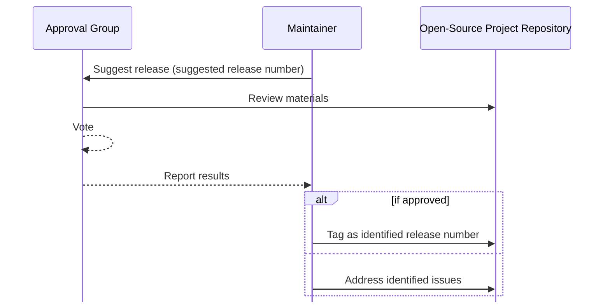

<!-- markdownlint-enable require-heading-body -->

# Overview {.body}

## General {.body}

It might be tempting to think that managing an open-source standard can be achieved by using any general-purpose word processor that supports a collaborative development environment. However, one will quickly discover that these tools lack key features that are required for industry standards. For example, the two biggest issues are:

- Every edit made to a draft standard needs to be reviewed before being incorporated into a final product. General-purpose, collaborative word processors typically allow anyone with edit rights to edit the document without any traceability. If this was used for a draft standard, anyone with editing rights could make a minor change in the text immediately before the document was approved. The minor textual change could easily be missed by most reviewers while impact of a minor textual change could be significant (e.g., changing "shall" to "shall not"). Thus, rather than allowing peers to edit a common document, the process proposed in this document requires contributors to offer alternative text in a format where their proposal can be viewed and compared against the existing draft before it is incorporated into the final text.

- Standards are used for deployments that can remain in operation for decades. It is important that industry professionals can quickly access any prior released version of the standard so that they can understand devices that were previously deployed. General-purpose word processors generally only deal with one version of a document while the GitHub environment recommended by this document allows a complete version control history that allows users to display any archived version of the document.

To overcome these challenges, this document recommends using a `git` environment (in the case of NTCIP, one hosted at GitHub) that leverages markdown and Material for MkDocs as the primary documentation environment.

Managing a project within this open-source environment involves four major activities as described in the following clauses:

1. Establishing the project
2. Processing comments
3. Processing contributions
4. Approving releases

## Establishing the Project {.body}

<next-fig /> provides an overview of the process to establish a new open-source project.

<figure><figcaption>Establish a new open-source project</figcaption></figure>

When someone identifies a need for a new shared resource (e.g., industry
standard, reusable code, etc.) within ITS, they can develop a proposal and
submit it to an appropriate committee. The
proposal can be relatively simple (e.g., a statement of goals and structure) or
a complete prototype.

If the proposal is accepted by the committee, the committee will assign a working group and one or more
maintainers who will become responsible for leading the project. This will often
include the individual proposing the project. A maintainer will establish the
open-source project repository on the standards development organization's
open-source website (e.g., GitHub account) and upload the initial project files.

!!! note
    The maintainer is a key role in the project. If the maintainer is not available for any reason, it can delay the triage of identified issues. It is the responsibility of the committee to ensure that the maintainer either has sufficient resources or has sufficient backup to provide a high degree of confidence that there is not an artificial bottleneck when contributors wish to address problems.

Once the initial upload is provided, the maintainer will work with the working
group to refine the vision for the project and establish the set of baseline
issues as a part of the project plan. The project plan will also define the
planned release schedule, which can be based on a calendar schedule, reaching
milestones, or achieving other metrics. Members of the WG are encouraged to
submit their issues directly so that the originator can be properly captured and
to encourage WG members to become familiar with the process; however, the
Maintainer can submit comments on the behalf of others, if needed.

The Maintainers are also responsible for properly managing the GitHub registry structure according to project policies. For example, this might include establishing a `draft` branch and ensuring all contributions are merged into this branch as appropriate. It might also define rules on when to tag committed versions as a release or pre-release and ensuring that GitHub actions properly run to generate updates to the website with all appropriate information.

The goal should be to have both the generated website and the GitHub page to default to the latest approved version (if an approved version exists) and should allow viewing any prior formal release or the most recent working draft (i.e., pre-release). Other versions can be provided as well at the WG's direction. The generated website should include a banner at the top of each page indicating the status of the currently displayed version, unless it is the latest approved version.

## Process comments {.body}

<next-fig /> provides an overview of how comments are processed for an open-source
project.

<figure><figcaption>Process comments for an open-source project</figcaption></figure>

Users of open-source projects often have questions, encounter bugs, request
features, or provide feedback on usability. Submitting comments is the primary
way for the community to help guide the development of the project. Comments can be submitted at any time.

When comments are submitted, maintainers (and other followers) are notified. If
the comment is submitted as an issue (as opposed to a discussion item), the
maintainer triages the issue by determining its relevance, classification (e.g.,
bug, documentation issue), and priority. If needed, the maintainer can discuss
the issue with the commenter or sponsoring WG to ensure consensus from the
broader community.

Each project should identify its goals for triaging submitted issues. By default, projects should have a goal of triaging all comments within one month of their submittal, but the exact timeline might vary based on available resources, the criticality of the project, and other factors. If a submitted issue is not triaged within this timeline, the submitter should contact the parent standards development organization for guidance.

As a result of the review, the issue can be accepted, merged
with another issue, split into multiple issues, or rejected (e.g., if it does
not fit with the project's goals). Once the triage is complete, the maintainer
adds tags as appropriate to the issue so that it can properly be managed.

## Process Contributions {.body}

<next-fig/> provides an overview of processing contributions to an open-source project.

<figure><figcaption>Process contributions to an open-source project</figcaption></figure>

Open-source projects encourage contributions from the community, allowing others
to solve issues or implement features. Contributors gain experience and
recognition, while the project benefits from a broader range of solutions.

Interested contributors browse the list of open issues, claim one they are
interested in, and start working on a solution. When they have developed and
tested their proposed solution, they submit a request for the maintainer to
"pull" a copy of their changes from their site. This is known as a pull request
(PR).

When a PR is submitted, the maintainer is automatically notified and is
responsible for reviewing the request to ensure that it:

- can be safely merged with the project without overwriting other changes,
- solves the stated problem without introducing bugs, and
- meets the project's guidelines (e.g., coding standards).

During the review process, the maintainer can communicate with the contributor
if questions arise or with the WG to ensure consensus on the details of the
proposed change. If the process identifies any issues with the proposed change,
it can be returned to the contributor to make additional revisions. If the
changes are deemed to be satisfactory, the maintainer can accept the pull
request and the changes will be merged into the open-source project.

## Approve Releases {.body}

<next-fig/> provides an overview of the process to approve a new release of an
open-source project.

<figure><figcaption>Approve releases for an open-source project</figcaption></figure>

Releasing a project allows users to access a stable, tested version with new
features, bug fixes, or improvements. It also provides a versioned snapshot that
is easier to manage and distribute.

Once all expected changes have been made to fulfil a defined stage in the
project plan, the maintainer will follow the project's defined process for
obtaining approval of the current draft as a formal release (e.g., v01.01.03)
from the identified approval group (e.g., perhaps selected experts for a patch, the WG for a new feature, or the parent committee for non-backwards compatible changes). The exact approval group is defined in the project's plan.

If approval is received, the maintainer:

- documents changes in release notes (if not already included);
- if it is a full release, moves the version to the main branch;
- tags the current version as a new release (e.g., "v01.01.03"); and
- provides a downloadable archive.

If approval is not received, the maintainer ensures that all of the identified issues are properly recorded on the issues page and continues the process of addressing issues through contributions.

This collaborative process allows open-source projects to evolve through
contributions from users and developers worldwide, promoting continuous
improvement while ensuring transparency and accountability.

